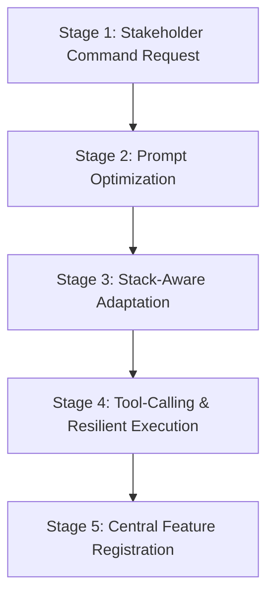

# Business Specification: Core Infrastructure (Universal Agent Hub)

## Translation Registry
* **Input Term:** "Core Infrastructure"
* **Resolved Node:** [[TECHNICAL_SPECS]], [[BUSINESS_FLOW]]
* **Deduction Rationale:** Dynamically resolved from the Global Symbol Registry (`docs/pages/registry.md`). This document synthesizes the technical specs, operational entry points, prompt optimization pipelines, dynamic stack-aware rules, and quality assurance guardrails into a single high-fidelity, non-technical business reference.

---

## 1. Executive Summary
The **Universal Agent Hub** is a robust, portable orchestration engine designed to manage specialized AI agents across multiple development environments. By unifying various AI assistants under a single cohesive platform, it ensures absolute architectural standards, regulatory compliance, and consistent quality gates. 

Stakeholders, Product Owners, and Business Analysts can leverage the Hub's capabilities to maintain perfect alignment between business goals, automated testing pipelines, and live software codebases.

---

## 2. Command Orchestration Engine
The Hub provides standard entry points to manage AI interactions, configure localized environments, and link system-wide guidelines directly to target development projects.

### Entry Point & Command Matrix
| Command Name | Operational Scope | Business Objective & Expected System Behavior |
| :--- | :--- | :--- |
| **Serve (`serve`)** | Internal Gateway / AI Runtime | Spawns the central orchestration server, facilitating direct, high-performance direct I/O communication between external AI tools and the project. |
| **Bootstrap (`bootstrap`)** | Local Development Setup | Automatically configures the local developer machine with pre-requisite Model Context Protocol (MCP) integrations (including secure local filesystem access and web browser automation tools). |
| **Link (`link`)** | Development Project Root | Establishes a direct, permanent connection between the AI's core persona guidelines and the project's workspace-specific rules files (such as `.cursorrules`). |

---

## 3. The Orchestration & Prompt Optimization Pipeline
To prevent information overload and context bloat, the Hub incorporates an **Advanced Prompt Assembly Pipeline**. This system dynamically filters and compresses technical context, ensuring the AI only processes information strictly relevant to the task at hand.

### Prompt Assembly & Optimization Rules
* **Late-Binding Deduplication:** Automatically scans AI instruction prompts to prevent double-injection of base files, saving substantial context space and processing time.
* **Heuristic Relevance Filtering:** Reads the active command keywords and selectively loads only the matching instruction modules (e.g., documentation maintenance standards are only loaded for documentation tasks, and security review rules are only loaded for audit tasks). This reduces prompt overhead by up to **70%**.

---

## 4. Intelligent Stack-Aware Adaptation
The Hub features a **Heuristic Stack Detection Engine** that automatically inspects the project's root folder to identify the programming languages and frameworks in use. Once detected, the system automatically adapts its guidelines to match.

### Stack Detection & Adaptation Matrix
| Detected Stack | Clue Identifiers | System Action & Business Benefit |
| :--- | :--- | :--- |
| **Microsoft .NET** | Project files (`.csproj`, `.sln`, `global.json`) | Automatically adapts AI logic to prioritize standard C# enterprise guidelines, dependency injection, and .NET architecture standards. |
| **Java / JVM** | Build files (`pom.xml`, `build.gradle`, `build.gradle.kts`) | Adapts the AI to enterprise Spring Boot design patterns, secure JVM configurations, and standard dependency paradigms. |
| **Google Flutter** | Configuration (`pubspec.yaml`, `*.dart`) | Adapts to mobile-first structures and initializes automated AST-sync widget trees for consistent UI layout coding. |
| **React Framework** | Manifest (`package.json` with "react" import) | Prioritizes single-page-app optimization rules, reusable functional components, and standard React hooks. |
| **Angular Framework** | Workspaces (`angular.json`, `nx.json`) | Enforces modular enterprise frontend architectures, standard services, and RxJS reactive patterns. |
| **Vue Framework** | Components (`*.vue`, `vue.config.js`) | Prioritizes progressive composition API structures, reactive state management, and semantic templates. |
| **TypeScript / JavaScript** | Configs (`tsconfig.json`, `*.ts`, `*.js`) | Enforces strict type safety, modern ECMAScript standards, and optimal build compilation settings. |

---

## 5. Global Business Guardrails & Quality Gates
Every operation processed within the Universal Agent Hub must strictly comply with established quality assurance standard gates.

### Quality Verification Matrix
| Verification Gate | Core Guardrail Requirement | Business Outcome & Risk Mitigation |
| :--- | :--- | :--- |
| **Rule 0: PRD-First** | No implementation plan or coding can begin without a validated Feature Product Requirements Document (PRD). | Ensures 100% alignment between business requirements and technical development before coding. |
| **Rule 1: Human Approval** | Mandatory user-in-the-loop checkpoints at each key phase transition (planning, code design, and review). | Prevents AI hallucination from impacting active code and keeps stakeholders fully in control. |
| **Rule 2: Test-First** | Code implementation is incomplete until unit tests are developed and all tests achieve a 100% pass rate. | Eliminates code regressions, bugs, and functional drift, maintaining high system stability. |
| **Rule 3: License Guard** | Automatic halt and risk analysis reporting if a commercial or paid software library is introduced. | Prevents legal liabilities, intellectual property infringement, and unexpected operational licensing costs. |

---

## 6. User-Centric Command Execution Journey
When a Business Analyst or developer triggers a command within the Hub, the system executes the following seamless 5-stage orchestration journey:

### Stage-by-Stage Narrative Journey
1. **Stage 1: Stakeholder Command Request:** The stakeholder or AI client issues a command with specific functional goals (e.g., asking to review compliance rules).
2. **Stage 2: Intelligent Prompt Optimization:** The Hub's Prompt Optimizing Engine dynamically processes the request, filters out redundant common standards, and compiles an ultra-lightweight, high-focus context prompt.
3. **Stage 3: Stack-Aware Adaptation:** The Hub scans the workspace root, detects the project's exact backend/frontend technology stacks, and automatically injects custom tech standard guidelines.
4. **Stage 4: Tool-Calling & Resilient Execution:** The AI checks for local MCP server tools (like secure file manipulation or automated browser verification). If specialized MCP tools are missing, the system gracefully degrades to static review prompts to guarantee a successful outcome.
5. **Stage 5: Central Feature Registration:** Once the operation finishes, the system automatically registers the generated documentation or features under the central Project Registry (`docs/pages/registry.md`) for stakeholder visibility and reporting.
