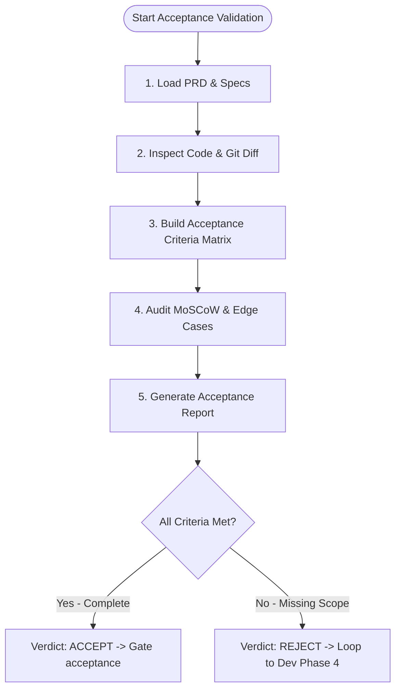

# Skill: Product Acceptance & Requirement Validation Protocol

## 1. Overview & Purpose
This skill equips the **Product Owner (PO)** to perform **Product Acceptance Testing (PAT)** and requirement confrontation against implemented features. 

While automated tests and peer reviews confirm code correctness and style, this protocol validates that the delivered solution accurately addresses the original business requirements, user stories, edge cases, and Given-When-Then acceptance criteria defined in the Product Requirements Document (PRD).

---

## 2. Core Operating Principles
1. **Zero Assumption Validation:** Never assume a feature works as intended simply because unit/integration tests pass. Explicitly verify code logic, API endpoints, UI states, and data models against each user story.
2. **MoSCoW Adherence:** Every requirement tagged with `Must Have` must be 100% verified. Any missing or degraded `Must Have` requirement triggers an immediate `REJECT / REVISE` verdict.
3. **Acceptance Criteria (Gherkin) Mapping:** Check each `Given-When-Then` scenario against automated test assertions and implementation branches.
4. **Constructive & Actionable Feedback:** When rejecting or requesting scope fixes, provide precise file references, line numbers, and actionable remediation notes for developer agents.

---

## 3. Step-by-Step Execution Workflow



### Step 1: Ingest PRD & Specifications
1. Locate and read the feature PRD at `docs/pages/{{args}}-prd.md` (or workspace equivalent).
2. Extract:
   - **User Stories:** `As a... I want... So that...`
   - **Functional Requirements (FRs):** Titles, descriptions, and MoSCoW priorities.
   - **Acceptance Criteria:** Specific Gherkin `Given-When-Then` blocks.
   - **Edge Cases & Error Scenarios:** Expected fallbacks and system boundaries.
   - **Non-Functional Requirements (NFRs):** Performance, security, compliance constraints.

### Step 2: Codebase & Git Diff Inspection
1. Inspect the Git status and recent commits on the feature branch (`git diff` or changed files).
2. Inspect the test suites created by the developer (e.g., unit, integration, e2e tests).
3. Inspect the API endpoints, UI components, data structures, and state managers implementing the feature.

### Step 3: Confrontation & Criteria Evaluation
Evaluate each requirement systematically:
- **Coverage Check:** Is there a dedicated test suite or clear logic covering this requirement?
- **Behavioral Alignment:** Does the implementation behavior match the expected business outcome?
- **Negative & Edge Paths:** Are the edge cases outlined in Section 7 of the PRD handled, or does the code fail silently/throw unexpected errors?
- **Unintended Scope Creep:** Were undocumented or unauthorized features added that deviate from the PRD?

### Step 4: Compile Product Acceptance Report
Draft the formal acceptance report to **`docs/pages/{{args}}-acceptance.md`** using the template at `po/templates/acceptance_report.md`.

The report must include:
- Logseq header metadata (`type:: [[AcceptanceReport]]`, `status:: [[ACTIVE]]`, etc.).
- Acceptance Criteria Verification Table with status for each criterion (`PASS`, `FAIL`, `PARTIAL`).
- MoSCoW Scope Fulfillment Summary.
- Edge Case & Negative Flow Assessment.
- Clear Verdict: `ACCEPT` or `REJECT`.

---

## 4. Decision Gates & Feedback Loops

### Path A: Verdict = ACCEPT
- When 100% of `Must Have` requirements and all defined `Acceptance Criteria` are fulfilled:
- Mark the acceptance report status as `[[APPROVED]]`.
- Present the summary to the user and call:
  ```json
  tech_agents:request_approval(
    gate="acceptance",
    artifact_path="docs/pages/{{args}}-acceptance.md",
    summary="Product Acceptance complete. All PRD acceptance criteria and user stories verified against the implementation."
  )
  ```

### Path B: Verdict = REJECT (Scope Gaps / Deviations)
- When any `Must Have` criteria are missing, broken, or misaligned with the business intent:
- Detail the specific gaps in the `Remediation Backlog` section of the report.
- Emit a clear `REJECT` finding back to the Squad Orchestrator.
- Do NOT advance the `acceptance` gate. The orchestrator reverts control to the **Developer Agent (Phase 4)** with the remediation backlog to implement the missing functionality and re-commit.
